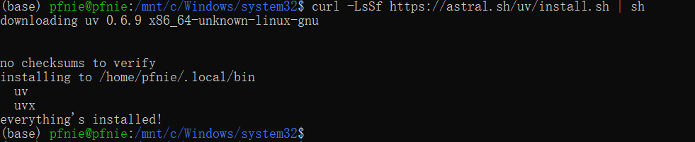
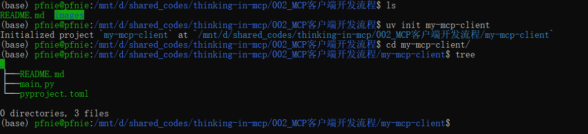
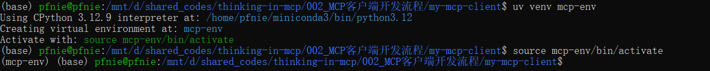
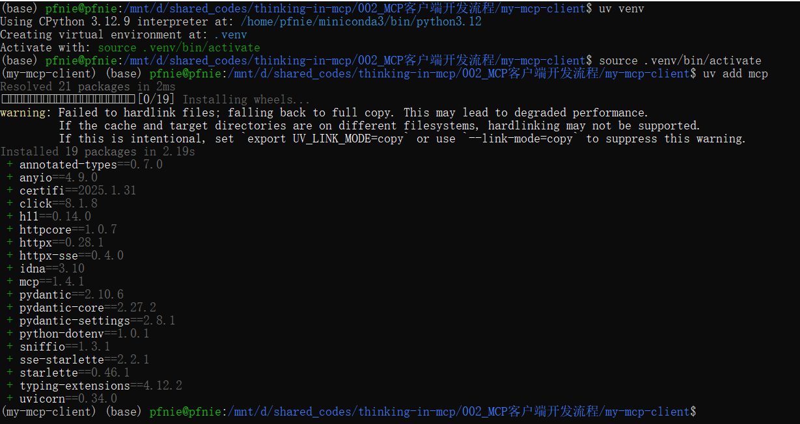
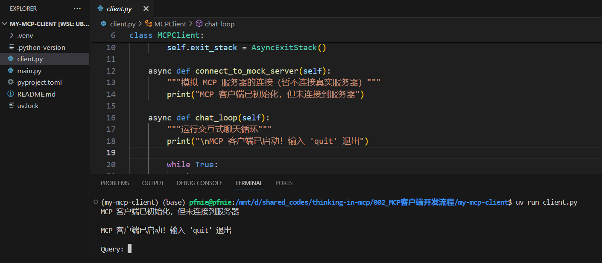
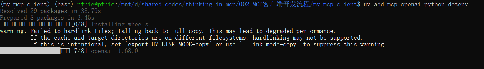
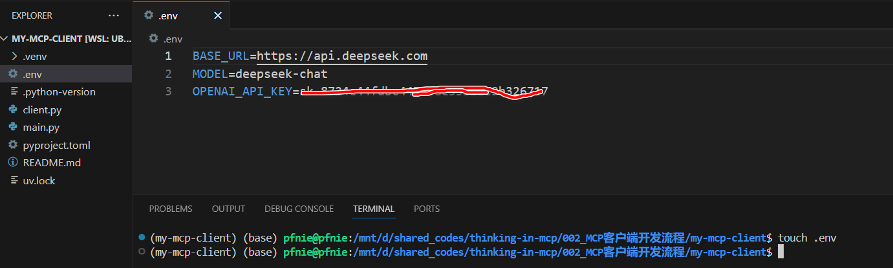
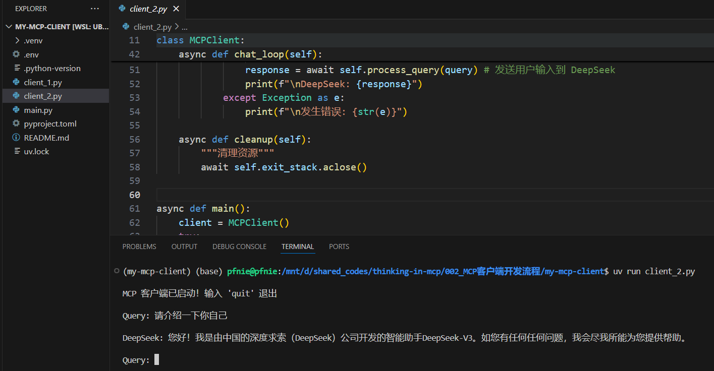

# MCP客户端开发流程

## 1. uv工具入门使用指南

### 1.1 uv入门介绍

MCP开发要求借助uv进行虚拟环境创建和依赖管理。uv 是一个Python 依赖管理工具，类似于  pip 和  conda ，但它更快、更高效，并且可以更好地管理 Python 虚拟环境和依赖项。它的核心目标是 替代  pip 、 venv 和  pip-tools  ，提供更好的性能和更低的管理开销。 

uv 的特点： 

1. 速度更快：相比  pip ，uv 采用 Rust 编写，性能更优。
2.  支持 PEP 582：无需  virtualenv ，可以直接使用  
3. 兼容  pip  ：支持  __pypackages__ 进行管理。 requirements.txt 和  pyproject.toml 依赖管理。 
4. 替代  venv  ：提供  uv venv 进行虚拟环境管理。
5. 跨平台：支持 Windows、macOS 和 Linux

### 1.2 uv安装流程  

方法 1：使用  pip 安装

```bash
pip install uv
```

方法 2：使用  curl 直接安装

```bash
curl -LsSf https://astral.sh/uv/install.sh | sh
```

这会自动下载 uv 并安装到  /usr/local/bin



## 2.MCP极简客户端搭建流程

### 2.1 创建MCP客户端项目

```bash
uv init my-mcp-client
cd my-mcp-client
```



### 2.2 创建MCP客户端虚拟环境

```bash
# Create virtual environment
uv venv
# On Unix or MacOS:
source .venv/bin/activate
```



然后即可通过add方法在虚拟环境中安装相关的库。

```bash
# 安装 MCP SDK
uv add mcp
```



### 2.3 编写基础MCP客户端

然后在当前项目主目录中创建client.py, 并写入如下代码：

```python
import asyncio
from mcp import ClientSession
from contextlib import AsyncExitStack


class MCPClient:
    def __init__(self):
        """初始化 MCP 客户端"""
        self.session = None
        self.exit_stack = AsyncExitStack()

    async def connect_to_mock_server(self):
        """模拟 MCP 服务器的连接（暂不连接真实服务器）"""
        print("MCP 客户端已初始化，但未连接到服务器")

    async def chat_loop(self):
        """运行交互式聊天循环"""
        print("\nMCP 客户端已启动！输入 'quit' 退出")

        while True:
            try:
                query = input("\nQuery: ").strip()
                if query.lower() == 'quit':
                    break
                print(f"\n[Mock Response] 你说的是：{query}")
            except Exception as e:
                print(f"\n发生错误: {str(e)}")

    async def cleanup(self):
        """清理资源"""
        await self.exit_stack.aclose()


async def main():
    client = MCPClient()
    try:
        await client.connect_to_mock_server()
        await client.chat_loop()
    finally:
        await client.cleanup()


if __name__ == "__main__":
    asyncio.run(main())
```

这段代码能够初始化 MCP 客户端（但不连接服务器），并提供一个 交互式 CLI，可以输入查询（但只返 回模拟回复），通过输入  quit 退出程序。需要注意的是，此时客户端没有关联任何大模型，因此只会 重复用户的输入。

### 2.4 运行MCP客户端

```bash
uv run client.py
```



### 2.5 MCP客户端接入DeepSeek在线模型流程

接下来尝试在客户端中接入OpenAI和DeepSeek等在线模型进行对话。需要注意的是，由于OpenAI 和DeepSeek调用方法几乎完全一样，因此这套服务器client代码可以同时适用于GPT模型和DeepSeek。

#### 2.5.1 新增依赖

为了支持调用DeepSeek模型，以及在环境变量中读取API-KEY等信息，需要先安装如下依赖：

```bash
uv add mcp openai python-dotenv
```



#### 2.5.2 创建.env文件

接下来创建.env文件，并写入DeepSeek的API-Key，以及服务地址。

```
touch .env
```



#### 2.5.3 修改后的client.py代码

```python
import asyncio
import os
from openai import OpenAI
from dotenv import load_dotenv
from mcp import ClientSession
from contextlib import AsyncExitStack

#加载.env文件,确保API KEY受到保护
load_dotenv()

class MCPClient:
    def __init__(self):
        """初始化 MCP 客户端"""
        self.exit_stack = AsyncExitStack()
        self.openai_api_key = os.getenv("OPENAI_API_KEY")
        self.base_url = os.getenv("BASE_URL")
        self.model = os.getenv("MODEL")
        
        if not self.openai_api_key:
            raise ValueError("OPENAI_API_KEY is not here, please setup into .env file.")
        
        self.client = OpenAI(api_key=self.openai_api_key, base_url=self.base_url)
        
    async def process_query(self, query: str) -> str:
        """调用 OpenAI API 处理用户查询"""
        messages = [{"role": "system", "content": "你是一个智能助手，帮助用户回答问题。"},
                    {"role": "user", "content": query}]
        
        try:
            # 调用 OpenAI API
            response = await asyncio.get_event_loop().run_in_executor(
                None,
                lambda: self.client.chat.completions.create(
                    model=self.model,
                    messages=messages
                )
            )
            return response.choices[0].message.content
        except Exception as e:
            return f"调用 OpenAI API 时出错: {str(e)}"

    async def chat_loop(self):
        """运行交互式聊天循环"""
        print("\nMCP 客户端已启动！输入 'quit' 退出")

        while True:
            try:
                query = input("\nQuery: ").strip()
                if query.lower() == 'quit':
                    break
                response = await self.process_query(query) # 发送用户输入到 DeepSeek
                print(f"\nDeepSeek: {response}")
            except Exception as e:
                print(f"\n发生错误: {str(e)}")

    async def cleanup(self):
        """清理资源"""
        await self.exit_stack.aclose()


async def main():
    client = MCPClient()
    try:
        await client.chat_loop()
    finally:
        await client.cleanup()


if __name__ == "__main__":
    asyncio.run(main())
```



### 2.6 MCP客户端接入本地ollama/vLLM模型

接下来，我们继续尝试将ollama、vLLM等模型调度框架接入MCP的client。由于ollama和vLLM均支持OpenAI API风格调用方法，因此上述client.py并不需要进行任何修改，我们只需要启动响应的调度框架服务，然后修改.env文件即可。

#### 2.6.1 MCP客户端接入本地ollama

这里以QwQ-32B为例，尝试借助ollama接入MCP客户端。

- 启动ollama 首先需要启动ollama

  ```bash
  ollama start
  ```

- 测试模型能否调用

  ```bash
  ollama list
  ollama run qwq
  ```

- 修改配置文件

  ```bash
  BASE_URL=https://localhost:11434/v1/
  MODEL=qwq
  OPENAI_API_KEY=ollama
  ```

#### 2.6.1 MCP客户端接入本地vLLM

- 启动vLLM服务

  ```bash
  cd /root/autodl-tmp
  CUDA_VISIBLE_DEVICES=0,1 vllm serve ./QwQ-32B --tensor-parallel-size 2
  ```

- 修改配置文件

  ```bash
  BASE_URL=https://localhost:8000/v1/
  MODEL=./QwQ-32B
  OPENAI_API_KEY=EMPTY
  ```

  