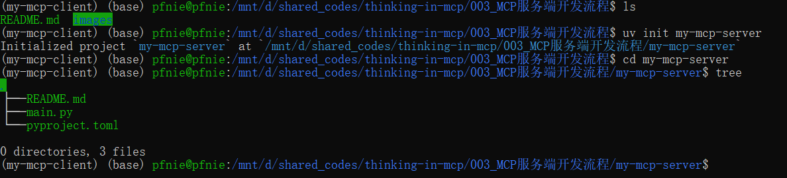
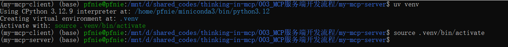
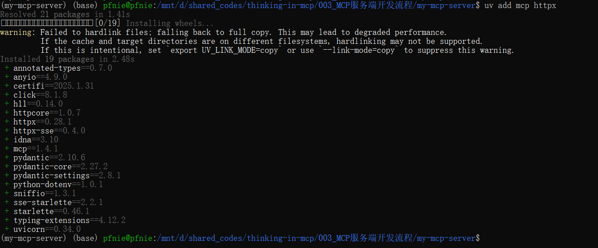
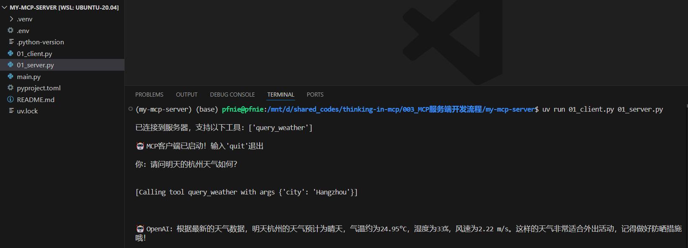

# MCP服务端开发流程

## 1. uv工具入门使用指南

### 1.1 uv入门介绍

MCP开发要求借助uv进行虚拟环境创建和依赖管理。uv 是一个Python 依赖管理工具，类似于  pip 和  conda ，但它更快、更高效，并且可以更好地管理 Python 虚拟环境和依赖项。它的核心目标是 替代  pip 、 venv 和  pip-tools  ，提供更好的性能和更低的管理开销。 

uv 的特点： 

1. 速度更快：相比  pip ，uv 采用 Rust 编写，性能更优。
2.  支持 PEP 582：无需  virtualenv ，可以直接使用  
3. 兼容  pip  ：支持  __pypackages__ 进行管理。 requirements.txt 和  pyproject.toml 依赖管理。 
4. 替代  venv  ：提供  uv venv 进行虚拟环境管理。
5. 跨平台：支持 Windows、macOS 和 Linux

### 1.2 uv安装流程  

方法 1：使用  pip 安装

```bash
pip install uv
```

方法 2：使用  curl 直接安装

```bash
curl -LsSf https://astral.sh/uv/install.sh | sh
```

这会自动下载 uv 并安装到  /usr/local/bin


## 2. 天气查询服务器创建流程

### 2.1 创建MCP服务端项目

```bash
uv init my-mcp-server
cd my-mcp-server
```



### 2.2 创建MCP服务端虚拟环境

```bash
# Create virtual environment
uv venv
# On Unix or MacOS:
source .venv/bin/activate
```



然后即可通过add方法在虚拟环境中安装相关的库。

```bash
uv add mcp httpx
```



### 2.3 编写天气查询MCP服务端

```python
import json
import httpx
from typing import Any
from mcp.server.fastmcp import FastMCP

# 初始化 MCP 服务器
mcp = FastMCP("WeatherServer")

# OpenWeather API 配置
OPENWEATHER_API_BASE = "https://api.openweathermap.org/data/2.5/weather"
OPEN_WEATHER_API_KEY = "9e14e02f316c831ed171fc091d2fbf64"  # 请替换为你自己的 OpenWeather API Key
USER_AGENT = "weather-app/1.0"


async def fetch_weather(city: str) -> dict[str, Any] | None:
    """
    从 OpenWeather API 获取天气信息。
    :param city: 城市名称（需使用英文，如 Beijing）
    :return: 天气数据字典；若出错返回包含 error 信息的字典
    """
    params = {
        "q": city,
        "appid": OPEN_WEATHER_API_KEY,
        "units": "metric",
        "lang": "zh_cn"
    }
    headers = {"User-Agent": USER_AGENT}
    async with httpx.AsyncClient() as client:
        try:
            response = await client.get(OPENWEATHER_API_BASE, params=params, headers=headers, timeout=30.0)
            response.raise_for_status()
            return response.json()  # 返回字典类型
        except httpx.HTTPStatusError as e:
            return {"error": f"HTTP 错误: {e.response.status_code}"}
        except Exception as e:
            return {"error": f"请求失败: {str(e)}"}


def format_weather(data: dict[str, Any] | str) -> str:
    """
    将天气数据格式化为易读文本。
    :param data: 天气数据（可以是字典或 JSON 字符串）
    :return: 格式化后的天气信息字符串
    """
    # 如果传入的是字符串，则先转换为字典
    if isinstance(data, str):
        try:
            data = json.loads(data)
        except Exception as e:
            return f"无法解析天气数据: {e}"
    # 如果数据中包含错误信息，直接返回错误提示
    if "error" in data:
        return f"⚠ {data['error']}"
    # 提取数据时做容错处理
    city = data.get("name", "未知")
    country = data.get("sys", {}).get("country", "未知")
    temp = data.get("main", {}).get("temp", "N/A")
    humidity = data.get("main", {}).get("humidity", "N/A")
    wind_speed = data.get("wind", {}).get("speed", "N/A")
    # weather 可能为空列表，因此用 [0] 前先提供默认字典
    weather_list = data.get("weather", [{}])
    description = weather_list[0].get("description", "未知")
    return (
        f"🌍 {city}, {country}\n"
        f"🌡 温度: {temp}°C\n"
        f"💧 湿度: {humidity}%\n"
        f"🌬 风速: {wind_speed} m/s\n"
        f"⛅ 天气: {description}\n"
    )


@mcp.tool()
async def query_weather(city: str) -> str:
    """
    输入指定城市的英文名称，返回今日天气查询结果。
    :param city: 城市名称（需使用英文）
    :return: 格式化后的天气信息
    """
    data = await fetch_weather(city)
    return format_weather(data)


if __name__ == "__main__":
    # 以标准 I/O 方式运行 MCP 服务器
    mcp.run(transport='stdio')
```

### 2.4 编写天气查询MCP客户端

#### 2.5.1 新增依赖

```python
uv add mcp openai python-dotenv
```

#### 2.5.2 创建.env文件

```bash
touch .env

## 在该文件内添加如下配置
BASE_URL=https://api.deepseek.com
MODEL=deepseek-chat
OPENAI_API_KEY=<DeepSeek API Key>
```

#### 2.5.2 客户端代码

```python
import asyncio
import os
import json
from typing import Optional
from contextlib import AsyncExitStack
from openai import OpenAI
from dotenv import load_dotenv
from mcp import ClientSession, StdioServerParameters
from mcp.client.stdio import stdio_client


# 加载.env文件，确保API Key受到保护
load_dotenv()


class MCPClient:
    def __init__(self):
        """初始化MCP客户端"""
        self.exit_stack = AsyncExitStack()
        self.openai_api_key = os.getenv("OPENAI_API_KEY")  # 读取OpenAI API Key
        self.base_url = os.getenv("BASE_URL")  # 读取BASE YRL
        self.model = os.getenv("MODEL")  # 读取model

        if not self.openai_api_key:
            raise ValueError("❌未找到OpenAI API Key，请在.env文件中设置OPENAI_API_KEY")

        self.client = OpenAI(api_key=self.openai_api_key, base_url=self.base_url)
        # 创建OpenAI client
        self.session: Optional[ClientSession] = None
        self.exit_stack = AsyncExitStack()

    async def connect_to_server(self, server_script_path: str):
        """连接到MCP服务器并列出可用工具"""
        is_python = server_script_path.endswith('.py')
        is_js = server_script_path.endswith('.js')

        if not (is_python or is_js):
            raise ValueError("服务器脚本必须是.py或.js文件")

        command = "python" if is_python else "node"
        server_params = StdioServerParameters(
            command=command,
            args=[server_script_path],
            env=None
        )

        # 启动MCP服务器并建立通信
        stdio_transport = await self.exit_stack.enter_async_context(stdio_client(server_params))
        self.stdio, self.write = stdio_transport
        self.session = await self.exit_stack.enter_async_context(ClientSession(self.stdio, self.write))
        await self.session.initialize()

        # 列出MCP服务器上的工具
        response = await self.session.list_tools()
        tools = response.tools
        print("\n已连接到服务器，支持以下工具:", [tool.name for tool in tools])

    async def process_query(self, query: str) -> str:
        """
        使用大模型处理查询并调用可用的MCP工具 (Function Calling)
        """
        messages = [{"role": "user", "content": query}]

        response = await self.session.list_tools()

        available_tools = [{
            "type": "function",
            "function": {
                "name": tool.name,
                "description": tool.description,
                "parameters": tool.inputSchema
            }
        } for tool in response.tools]
        # print(available_tools)

        response = await self.client.chat.completions.create(
            model=self.model,
            messages=messages,
            tools=available_tools
        )

        # 处理返回的内容
        content = response.choices[0]
        if content.finish_reason == "tool_calls":
            # 如果是需要使用工具，就解析工具
            tool_call = content.message.tool_calls[0]
            tool_name = tool_call.function.name
            tool_args = json.loads(tool_call.function.arguments)

            # 执行工具
            result = await self.session.call_tool(tool_name, tool_args)
            print(f"\n\n[Calling tool {tool_name} with args {tool_args}]\n\n")

            # 将模型返回的调用哪个工具数据和工具执行完成后的数据都存入messages中
            messages.append(content.message.model_dump())
            messages.append({
                "role": "tool",
                "content": result.content[0].text,
                "tool_call_id": tool_call.id,
            })

            # 将上面的结果再返回给大模型用于生成最终的结果
            response = await self.client.chat.completions.create(
                model=self.model,
                messages=messages,
            )
            return response.choices[0].message.content

        return content.message.content

    async def chat_loop(self):
        """运行交互式聊天循环"""
        print("\n🤖 MCP客户端已启动！输入'quit'退出")
        while True:
            try:
                query = input("\n你: ").strip()
                if query.lower() == 'quit':
                    break

                response = await self.process_query(query)  # 发送用户输入到OpenAI API
                print(f"\n🤖 OpenAI: {response}")
            except Exception as e:
                print(f"\n⚠发生错误: {str(e)}")

    async def cleanup(self):
        """清理资源"""
        await self.exit_stack.aclose()


async def main():
    if len(sys.argv) < 2:
        print("Usage: python client.py <path_to_server_script>")
        sys.exit(1)
    client = MCPClient()
    try:
        await client.connect_to_server(sys.argv[1])
        await client.chat_loop()
    finally:
        await client.cleanup()


if __name__ == "__main__":
    import sys
    asyncio.run(main())
```

### 2.5 运行

```bash
uv run 01_client.py 01_server.py
```




**参考：**

OpenWeather官网： https://openweathermap.org/