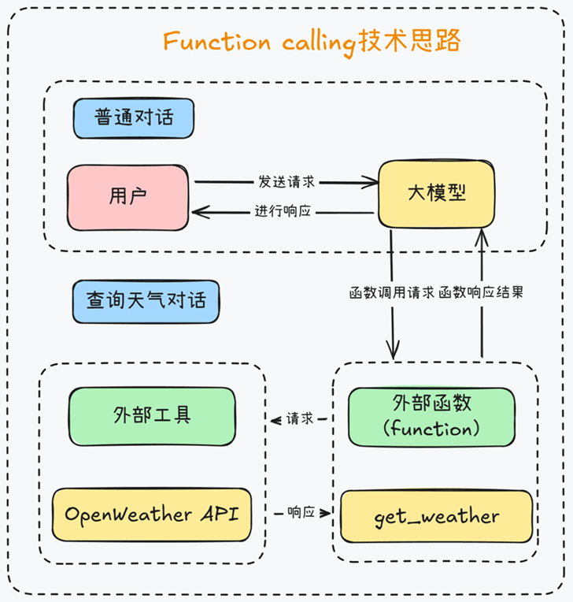

# MCP技术体系简介

## 1. 介绍

模型上下文协议 (MCP) 是一个开放协议，用于标准化应用程序如何向大语言模型 (LLM) 提供上下文信息。您可以将 MCP 视为 AI 应用的 USB-C 接口。正如 USB-C 提供了一种标准化的方式，将您的设备连接到各种外围设备和配件，MCP 也提供了一种标准化的途径，将 AI 模型连接到不同的数据源和工具。[Introduction - Model Context Protocol](https://modelcontextprotocol.io/introduction)

总的来说，MCP解决的最大痛点，就是Agent开发中调用外部工具的技术门槛过高的问题。 我们都知道，能调用外部工具，是大模型进化为智能体Agent的关键，如果不能使用外部工具，大模型就 只能是个简单的聊天机器人，甚至连查询天气都做不到。由于底层技术限制，大模型本身是无法和外部工具直接通信的，因此Function calling的思路，就是创建一个外部函数（function）作为中介，一边传递大模型的请求，另一边调用外部工具，最终让大模型能够间接的调用外部工具。

例如，当我们要查询当前天气时，让大模型调用外部工具的function calling的过程就如图所示：

Function calling是个非常不错的技术设计，自诞生以来，一直被业内奉为圭臬。但唯一的问题就是，编 写这个外部函数的工作量太大了，一个简单的外部函数往往就得上百行代码，而且，为了让大模型“认识” 这些外部函数，我们还要额外为每个外部函数编写一个JSON Schema格式的功能说明，此外，我们还需 要精心设计一个提示词模版，才能提高Function calling响应的准确率。 而MCP的目标，就是能在Agent开发过程中，让大模型更加便捷的调用外部工具。为此，MCP提出了两 个方案，其一，“车同轨、书同文”，统一Function calling的运行规范。 首先是先统一名称，MCP把大模型运行环境称作 MCP Client，也就是MCP客户端，同时，把外部函数运 行环境称作MCP Server，也就是MCP服务器.

然后，统一MCP客户端和服务器的运行规范，并且要求MCP客户端和服务器之间，也统一按照某个既定 的提示词模板进行通信。 “车同轨、书同文”最大的好处就在于，可以避免MCP服务器的重复开发，也就是避免外部函数重复编写。 例如，像查询天气、网页爬取、查询本地MySQL数据库这种通用的需求，大家有一个人开发了一个服务器就好，开发完大家都能复制到自己的项目里来使用，不用每个人每次都单独写一套。 这可是促进全球AI开发者共同协作的好事儿，很快，GitHub上就出现了海量的已经开发好的MCP服务器，从SQL数据库检索、到网页浏览信息爬取，从命令行操作电脑、到数据分析机器学习建模等，不一而足。

## 2. 常用的MCP Server

[https://mcp.so/server/mcp-browser-automation](https://mcp.so/server/mcp-browser-automation)

[https://mcp.so/servers?category=browser-automation](https://mcp.so/servers?category=browser-automation)

[https://glama.ai/mcp/servers](https://glama.ai/mcp/servers)

[LangChain MCP Adapters开源项目 – LangChain与MCP的无缝对接工具 | AI-magic](https://www.msbd123.com/sites/81541.html)

