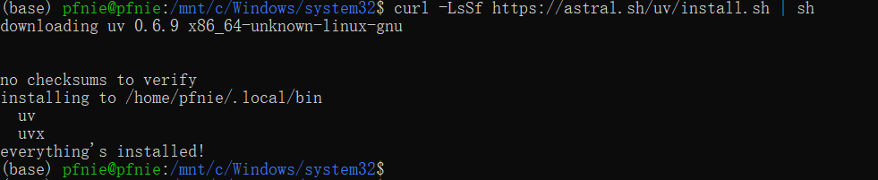

# UV开发工具入门指南

## 1. uv

### 1.1 uv入门介绍

MCP开发要求借助uv进行虚拟环境创建和依赖管理。uv 是一个Python 依赖管理工具，类似于  pip 和  conda ，但它更快、更高效，并且可以更好地管理 Python 虚拟环境和依赖项。它的核心目标是 替代  pip 、 venv 和  pip-tools  ，提供更好的性能和更低的管理开销。 

uv 的特点： 

1. 速度更快：相比  pip ，uv 采用 Rust 编写，性能更优。
2.  支持 PEP 582：无需  virtualenv ，可以直接使用  
3. 兼容  pip  ：支持  __pypackages__ 进行管理。 requirements.txt 和  pyproject.toml 依赖管理。 
4. 替代  venv  ：提供  uv venv 进行虚拟环境管理。
5. 跨平台：支持 Windows、macOS 和 Linux

### 1.2 uv安装流程  

方法 1：使用  pip 安装

```bash
pip install uv
```

方法 2：使用  curl 直接安装

```bash
curl -LsSf https://astral.sh/uv/install.sh | sh
```

这会自动下载 uv 并安装到  /usr/local/bin




