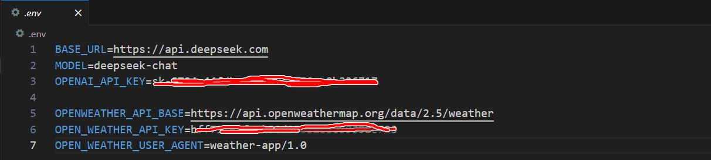

# Function Calling简单入门指南

## 1. 天气查询Function Calling

创建项目：

```bash
uv init my-weather-function-calling
cd my-weather-function-calling
# Create virtual environment
uv venv
# On Unix or MacOS:
source .venv/bin/activate
# 然后即可通过add方法在虚拟环境中安装相关的库。
uv add openai requests

```

设置开发相关的Key

```bash
# Create a `.env` file to store it, Create .env file
touch .env
```



Add `.env` to your `.gitignore`:

```bash
echo ".env" >> .gitignore
```

### 1.1 测试

运行测试：

```bash
source .venv/bin/activate
uv run main.py
```

**参考：**

- OpenWeather官网： [https://openweathermap.org/]( https://openweathermap.org/)