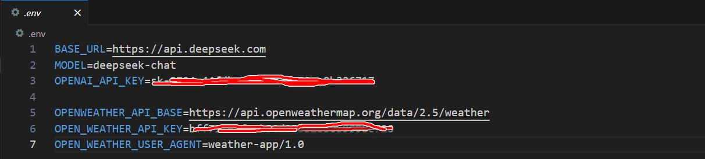

# Helloworld简单入门指南

## 1. 天气查询Helloworld

创建项目：

```bash
uv init my-weather-helloworld
cd my-weather-helloworld
```

创建虚拟环境

```bash
# Create virtual environment
uv venv
# On Unix or MacOS:
source .venv/bin/activate
# 然后即可通过add方法在虚拟环境中安装相关的库。
uv add mcp httpx openai python-dotenv fastapi aiohttp
```

设置开发相关的Key

```bash
# Create a `.env` file to store it, Create .env file
touch .env
```



Add `.env` to your `.gitignore`:

```bash
echo ".env" >> .gitignore
```

### 1.1 stdio transport 通信

创建服务器端与客户端代码：stdio_transport_server.py 和 stdio_transport_client.py

运行测试：

```bash
source .venv/bin/activate
uv run stdio_transport_client.py stdio_transport_server.py
```

### 1.2 **HTTP with SSE transport**通信

创建服务器端与客户端代码：http_with_sse_transport_server.py 和 http_with_sse_transport_client.py

```bash
source .venv/bin/activate
uv run http_with_sse_transport_server.py
uv run http_with_sse_transport_client.py
```


**参考：**

- OpenWeather官网： [https://openweathermap.org/]( https://openweathermap.org/)