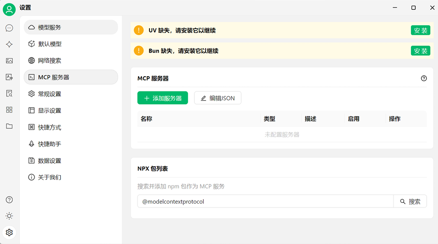
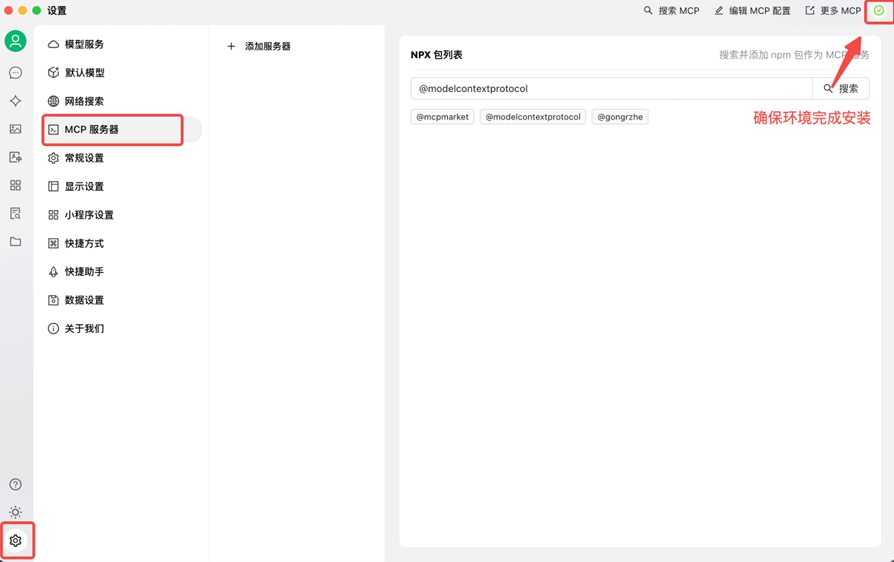
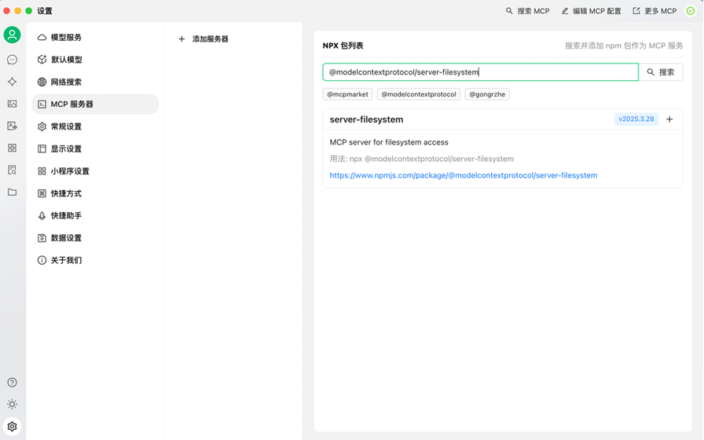
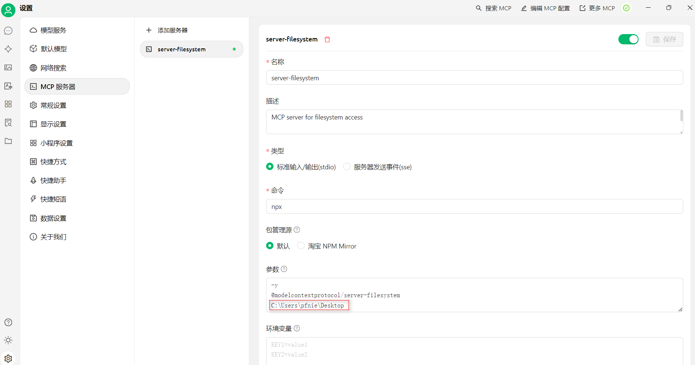
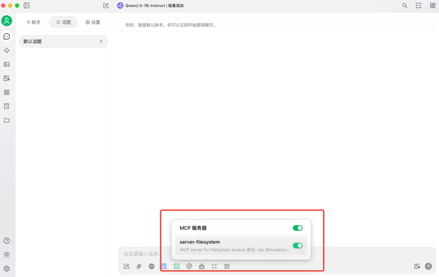
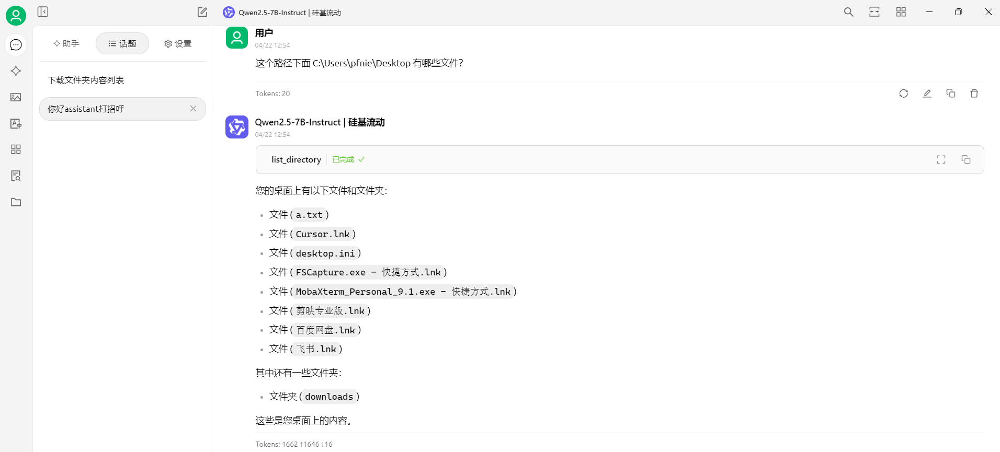

# 在CherryStudio中尝试MCP

 Cherry Studio  对于⼩⽩⽤⼾还是⽐较友好的，可以让你在客⼾端⼀键完成必备环境的安装：

打开 Cherry Studio  客⼾端，我们到「设置-MCP服务器」把上⾯提⽰的两个环境完成安装：

然后，我们在搜索框搜索 @modelcontextprotocol/server-filesystem，这⾥我们接⼊⼀ 个简单的⽂件系统MCP：

点击+，它会帮我们默认创建好⼀些MCPServer的配置，这⾥我们要补充⼀个参数，你允许让它访问 的⽂件夹路径：

C:\Users\pfnie\Desktop

然后我们点击保存，如果服务器的绿灯亮起，说明配置成功.

下⾯，我们到聊天区域选择⼀个模型，注意这⾥⼀定要选择带扳⼿🔧图标的模型，只有这种⼯具才⽀ 持MCP（因为CherryStudio其实本质上还是基于FunctionCall实现的MCP，所以只有部分模型⽀持）然后我们发现下⾯⼯具箱多了MCP的开关，我们把它打开：

然后我们尝试让他访问我桌⾯上有哪些⽂件：

调⽤成功，这就是⼀个最简单的MCP调⽤⽰例了。